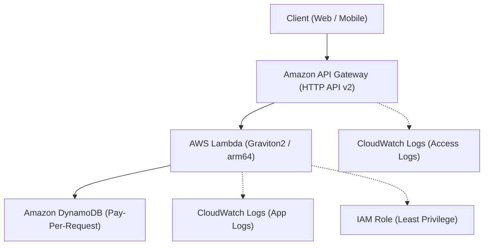

# Serverless API IaC Foundation on AWS 🚀

実務で圧倒的な支持を集める **Pure Serverless アーキテクチャ** に特化した、堅牢かつ極小運用コストの Terraform ベースインフラテンプレートです。

VPC や NAT Gateway を排したフルマネージド構成により、ゼロスケールによるコスト最適化とエンタープライズ品質のセキュリティ・可用性を両立させています。

---

## 🌟 インフラの特長 & ポイント

- **Pure Serverless 構成**: 高額な NAT Gateway 維持費やサブネット管理を全廃し、月額固定費を極限まで削減。
- **HTTP API v2 × Graviton2 (arm64)**: 超低レイテンシかつコストパフォーマンスに優れた最新コンピュートスタック。
- **最小特権の原則 (IAM)**: Lambda 実行ロールには対象 DynamoDB テーブルおよびログ出力のみの最小権限ポリシーを適用。
- **厳格な環境分離**: Blast Radius（影響範囲）を最小化するため、`dev` と `prod` をディレクトリレベルで完全分離。
- **セキュアな CI/CD**: 長期アクセスキーを排除した GitHub Actions OIDC 一時認証、PR 時の `tflint` / `trivy` セキュリティスキャンを標準化。

---

## 🏗️ アーキテクチャ構成図



---

## 📁 ディレクトリ構造

```text
.
├── .github/workflows/          # CI/CD パイプライン (OIDC / Plan / Apply)
├── modules/                    # 再利用可能な Terraform モジュール群
│   ├── api_gateway/            # HTTP API v2 + ログ設定
│   ├── lambda/                 # Graviton2 Lambda + 実行ロール
│   └── dynamodb/               # オンデマンド DynamoDB + PITR
└── environments/               # 環境別デプロイ定義
    ├── dev/                    # 開発環境用設定
    │   ├── main.tf
    │   ├── variables.tf
    │   ├── terraform.tfvars
    │   └── backend.tf
    └── prod/                   # 本番環境用設定 (PITR / 削除保護 有効)
        ├── main.tf
        ├── variables.tf
        ├── terraform.tfvars
        └── backend.tf
```

---

## 🚀 デプロイ手順

### 1. 前提条件
- Terraform >= 1.5.0
- AWS CLI (認証情報設定済み、または GitHub Actions OIDC)
- Remote Backend 用の S3 バケットおよび DynamoDB ロックテーブル

### 2. ローカル実行手順 (開発環境の例)

```bash
# 対象環境ディレクトリへ移動
cd environments/dev

# 初期化
terraform init

# 実行計画の確認
terraform plan

# インフラの適用
terraform apply
```

---

## 👥 キャスト (AIアプリ工場劇場 エンドロール)

- agent🔵: 要件定義・アーキテクチャコンセプト策定
- agent🍇: 構造設計・リファクタリング
- agent🍊: Terraform モジュール & 環境定義の実装
- agent🟢: セキュリティ監査・CI/CD 品質検証
- agent🟡: プロデュース & リポジトリ統合
